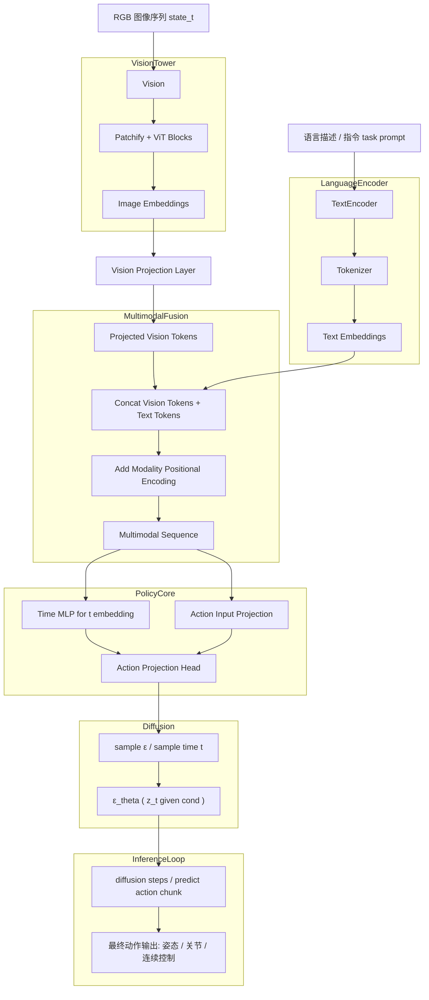

# Pi0.5 / PaliGemma 数据流说明

## 1. 输入
- **Image**：RGB 图像序列 (`state_t`)
- **Text**：语言描述或任务指令 (`task prompt`)

## 2. Vision Tower (SigLIP)
- Patchify 图像 + ViT Transformer Blocks
- 输出视觉 embedding（vision tokens）

## 3. Text Encoder (PaliGemma)
- Tokenizer 将文本转为 token
- Transformer 生成文本 embedding（text tokens）

## 4. Vision Projection
- 将视觉 embedding 投影到与 PaliGemma hidden size 对齐的维度
- 输出投影后的视觉 tokens

## 5. Multimodal Fusion
- 拼接视觉 tokens + 文本 tokens
- 添加 modality positional encoding
- 输出融合后的 multimodal sequence

## 6. Pi0.5 Policy Core
- **Action Input Projection**：处理动作历史
- **Time MLP**：生成 diffusion timestep embedding
- **Action Projection Head**：输出动作条件特征

## 7. Diffusion / Flow Matching
- 接收动作条件 + 噪声 `z_t`
- 预测噪声 `ε_theta`
- 进行 iterative denoise

## 8. Inference Loop
- 多步 diffusion 推理
- 输出最终动作（关节角度 / 姿态 / 连续控制）